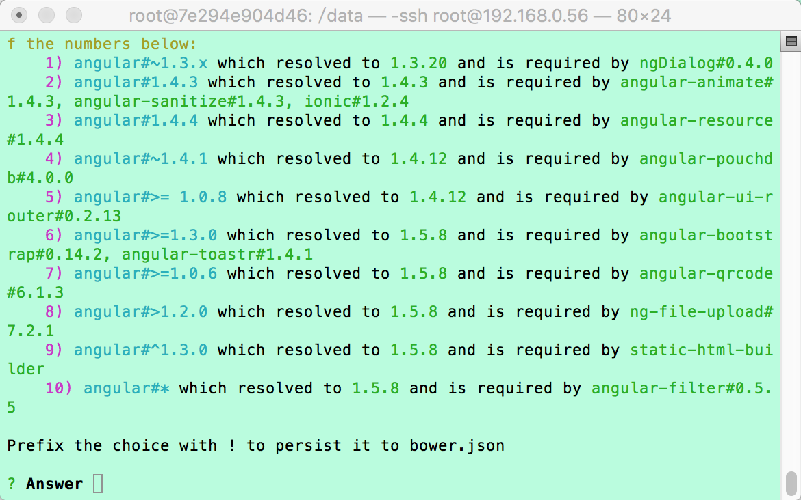

## 一 初始化的步骤
在搭建好环境的基础上，在/data目录下，我们要完成项目的初始化工作。
初始化分步进行：
首先，进行前台项目的检出；
接下来，是前台构建项目的检出，引入构建项目和前台项目的依赖；
最后，新建Cordova项目，并完成安卓平台的引入。

## 二 初始化的目录结构
－项目名（前台项目）
|
－项目名＋Builder（static-html-builder）
|
－项目名＋Cordova（cordova项目)
|
－init.sh（初始化项目脚本）
|
－build.sh（构建apk脚本）

## 三 开始初始化
1. 首先，运行初始化脚本
```
./init.sh
```
2. 接下来，根据下面提示输入svn的路径
```
Please input the svn path of your Project!
```
示例：
```
http://XX.XX.XX.XX/svn/VIS/VISAPP/branches/dev
```
3. 根据下面提示输入项目名称
```
Please input your Project Name!
```
示例，这样就可以在/data目录下新建一个叫XXXX的项目：
```
XXXX
```
4. 根据提示输入你的svn用户名密码，同意保存密码（输入yes），构建就开始了
5. 项目依赖可能会冲突，在构建过程中需要你去解决冲突；

6. 最后，等待构建完成吧。
7. 配置测试签名文件,替换系统中默认的测试签名文件：
```
cp XXXX/buildConfig/keyStore/android/test/debug.keystore ~/.android/debug.keystore
```
