## 一 jenkins介绍以及准备
我们可以利用jenkins＋docker完成持续集成。如果说docker是基础，jenkins就像是灵魂。

准备工作，在前端项目中要有：
1. 相关的cordova配置文件－config.xml
2. 相关的签名文件
3. 修改config.xml中版本号为模版{version},如下
```
<widget id="com.XXX.XXX" version="{version}" xmlns="http://www.w3.org/ns/widgets" xmlns:cdv="http://cordova.apache.org/ns/1.0">
```

## 二 新建任务
1. 点击新建
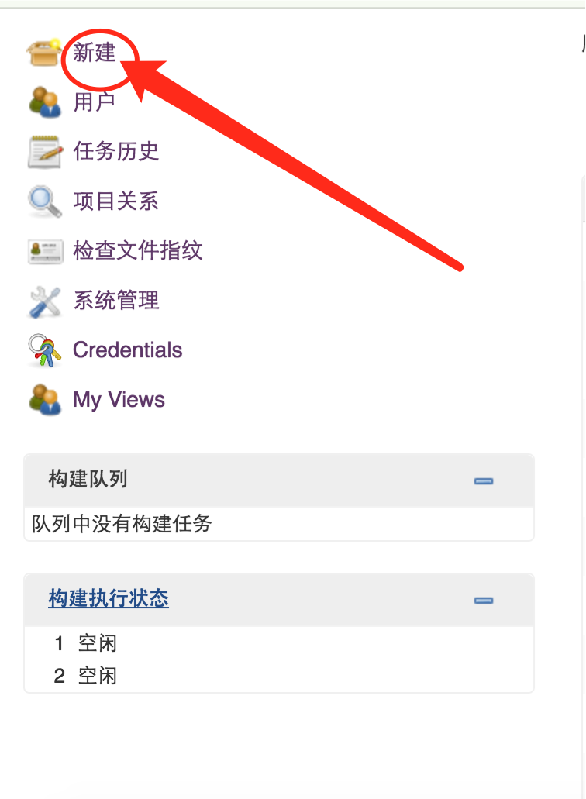
2. 输入项目名，选择构建一个自由风格的软件项目


## 三 参数化构建
1. 选择参数化构建过程，允许灵活构建
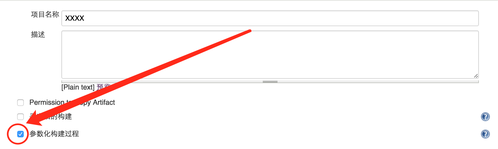
2. 新增参数
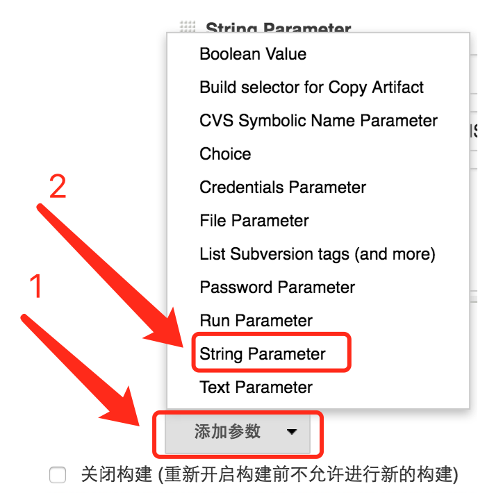
3. 设置应用版本号
示例：
```
version
0.0.0
应用版本号（数字.数字.数字）
```
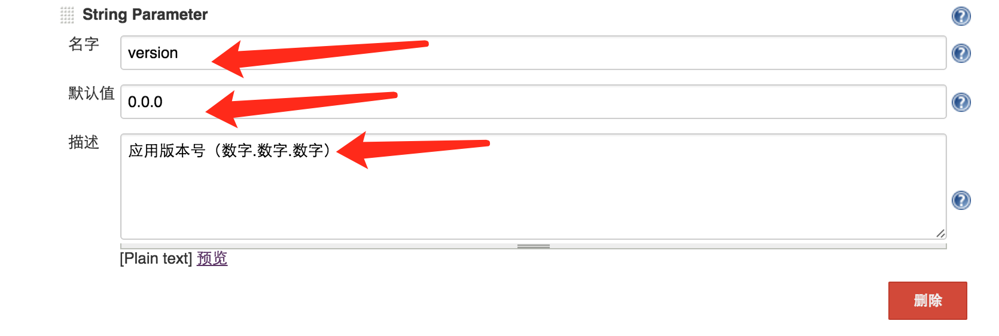
4. 设置grunt构建命令
```
command
build
grunt 构建命令
```
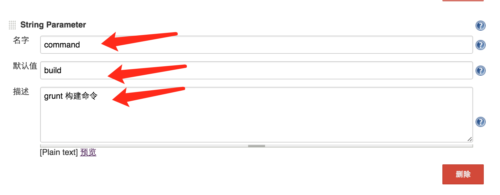
5. 设置svn路径
```
svnPath
http://XX.XX.XX.XX/svn/VIS/VISAPP/branches/dev
项目svn路径
```
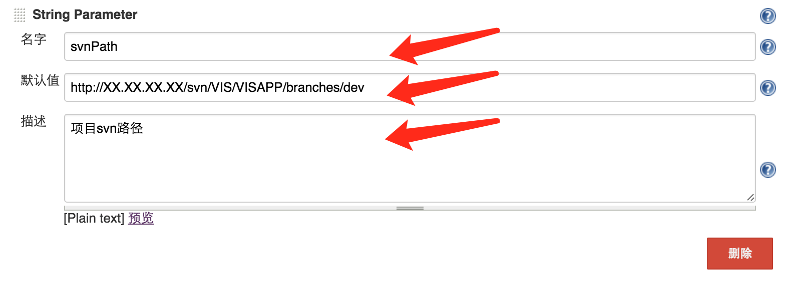

## 四 配置构建项
1. 点击增加构建步骤
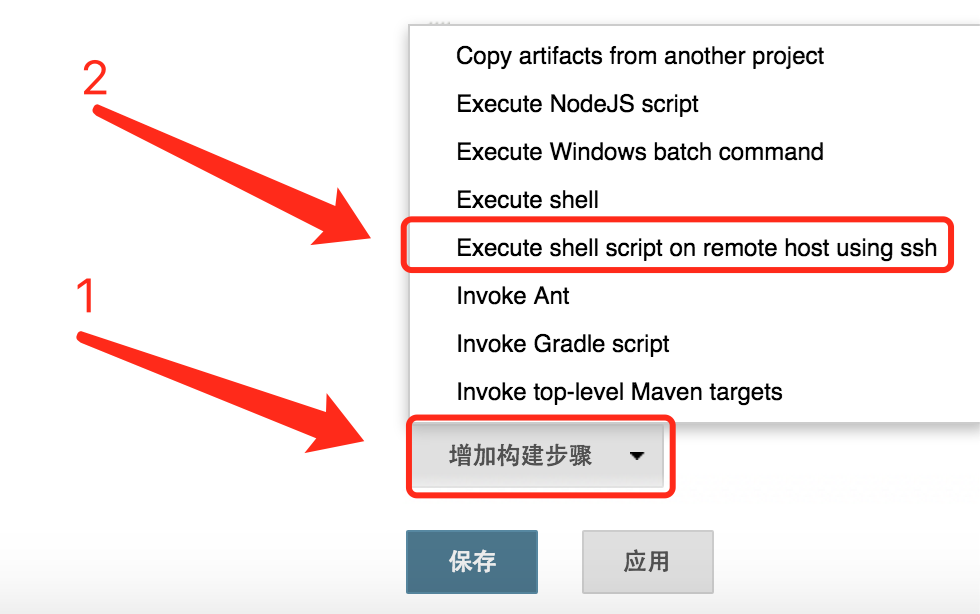
2. 配置构建脚本
构建脚本有两种：
第一是测试脚本，不需要配置签名
示例：
```
docker exec -i cordova /data/build.sh $svnPath $command XXXX XXXXCordova buildConfig/cordova/android/test/config.xml $version
```
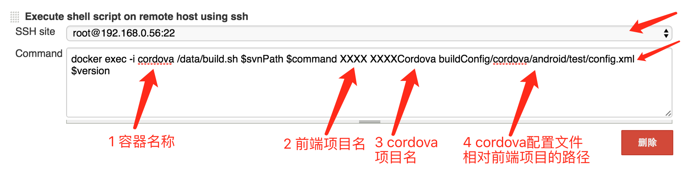
第二是正式脚本，需要配置签名
示例：
```
docker exec -i cordova /data/build.sh $svnPath $command XXXX XXXXCordova buildConfig/cordova/android/test/config.xml $version buildConfig/keyStore/android/formal/my-release-key.keystore android-armv7-release-unsigned.apk XXXX alias_name
```
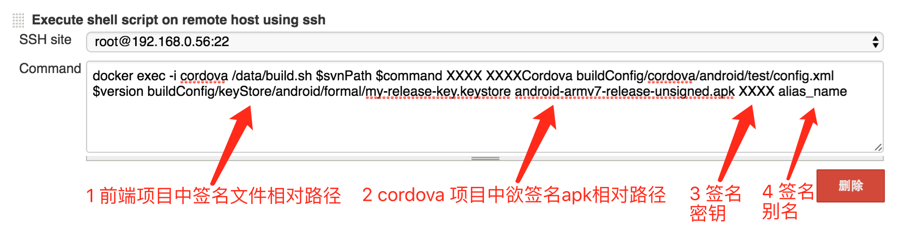
3. 配置拷贝生成结果脚本
示例：
```
docker cp cordova:/data/XXXXCordova/platforms/android/build/outputs/apk/android-armv7-debug.apk build.apk
docker cp build.apk myjenkins:/var/jenkins_home/workspace/XXXX/build.apk
```
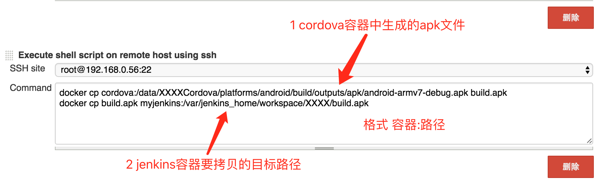

## 五 配置下载文件位置
1. 增加构建后操作步骤
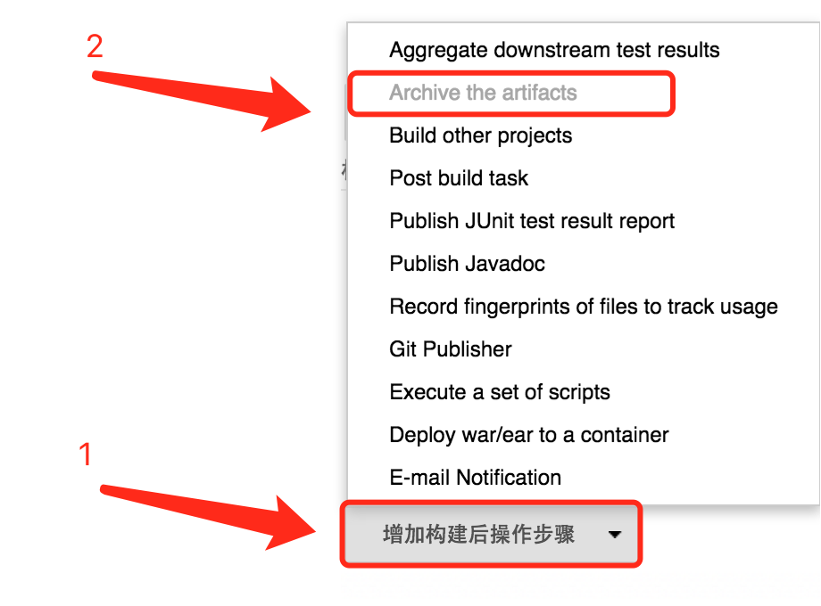
2. 配置下载文件位置（相对于任务工作目录的路径）
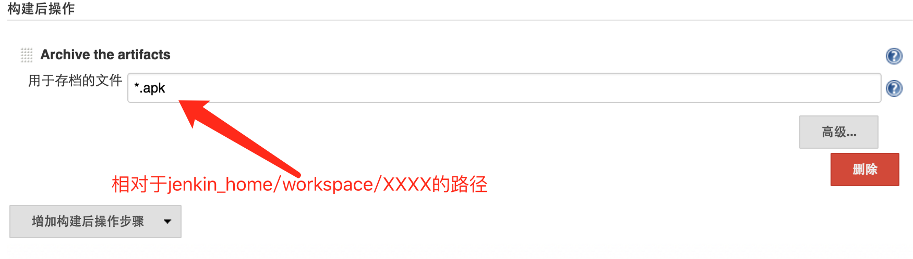
3. 最后，点击保存即可
